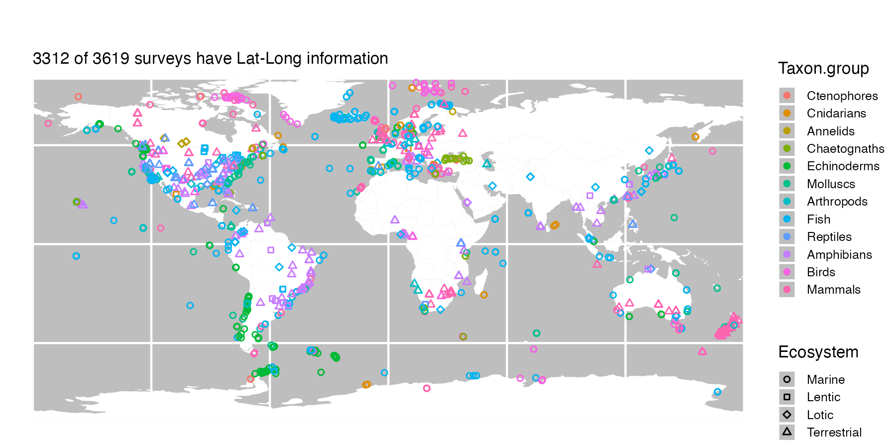
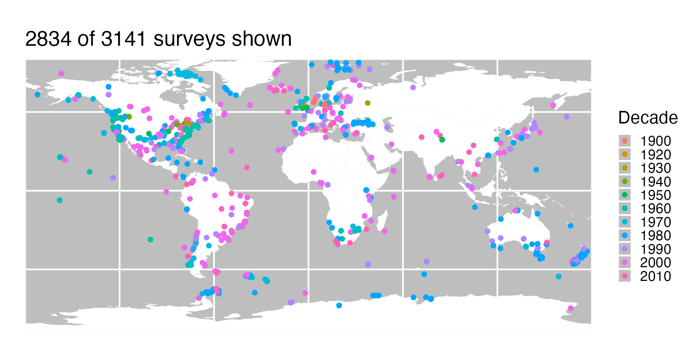
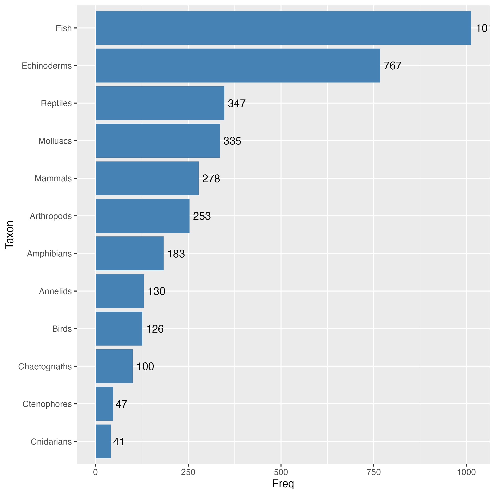
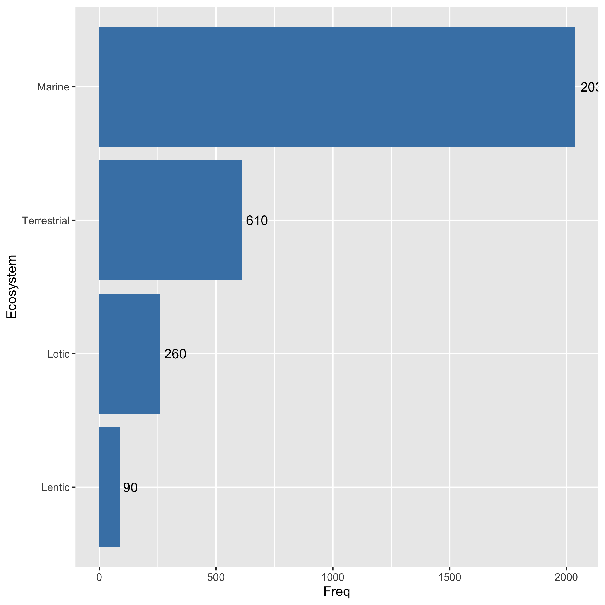

# FracFeed Database
This main directory contains the files associated with the complete, curated, and quality-controlled *FracFeed* database.  Please use these files (rather than those contained in */tmp_DB*) for your own analyses.

* *FracFeed_Data.csv* - the full, curated compilation of fraction-feeding and covariate data
* *FracFeed_Metadata.csv* - meta-data for the *FracFeed_Data*
* *FracFeed_Citations.csv* - source citations for the *FracFeed_Data*
* *FracFeed_Citations_BodyMass.csv* - source citations for body mass data

Taxonomic standardization uses the [Open Tree of Life](https://opentreeoflife.github.io/) through the [rotl package](https://cran.r-project.org/web/packages/rotl/index.html).

### Sub-directories:
* [Bib](Bib) - *Bibtex* bibliographic files for the citations
* [Figs](Figs) - Summary views of the data (shown below)
* [OtherData](OtherData) - Original auxilliary data sources
* [R](R) - Code for curating the raw data
* [tmp](tmp) - Temporary files created during data curation
* [tmp_DB](tmp_DB) - Curation-in-progress data

## Funding
Compiling of the database began with the support of a National Science Foundation award [DEB-1353827](https://www.nsf.gov/awardsearch/showAward?AWD_ID=1353827&HistoricalAwards=false).

## Citation
For current citation information, see [citation](CITATION.md).

## Please contribute data!
If you have or know of published predator diet surveys for which information with which to calculate the fraction of (non-)feeding individuals is available, please send us the associated citation ([mark.novak@oregonstate.edu](mark.novak@oregonstate.edu)).  Feel free to also suggest additional co-variates to start collecting information on.

## Summary views

