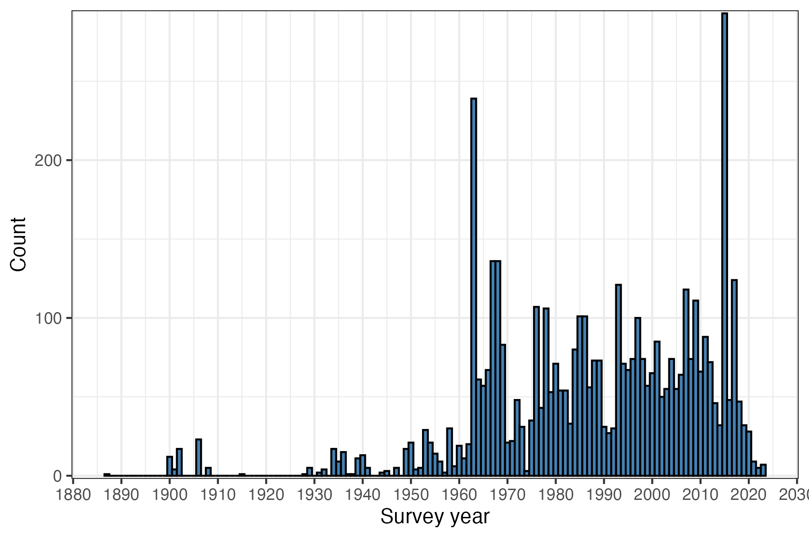
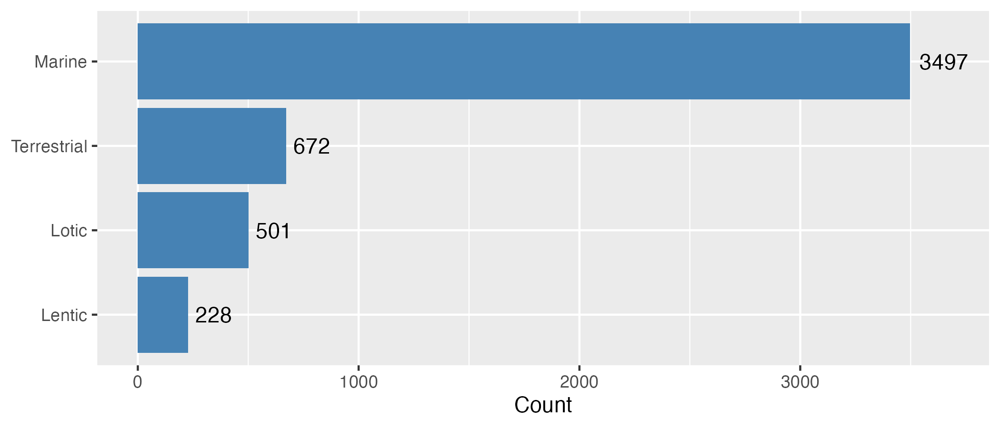
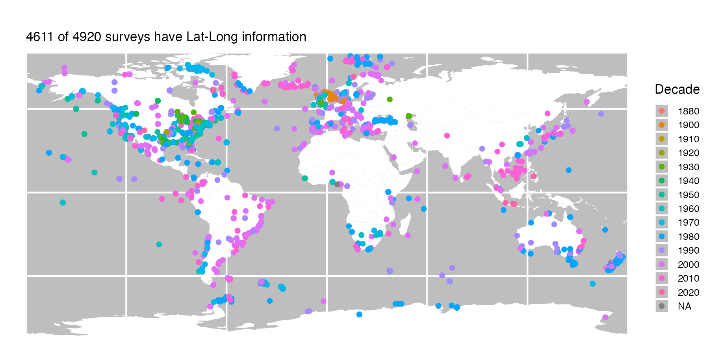

# FracFeed Database

A compilation of predator diet surveys that report on the proportion of "empty stomachs" or "not feeding individuals" (i.e., the *Frac*tion of *Feed*ing individuals).

This main directory contains the complete, curated, and quality-controlled *FracFeed* database:

* *FracFeed_Data.csv* and *FracFeed_Data.Rdata*
* *FracFeed_Data_Metadata.csv*
* *FracFeed_Citations.csv*
* *FracFeed_Citations_BodyMass.csv*

(The equivalent files in [*/tmp*](tmp) have not been quality-controlled.)

Taxonomic standardization uses the [Open Tree of Life](https://opentreeoflife.github.io/) through the [rotl package](https://cran.r-project.org/web/packages/rotl/index.html).

### Sub-directories:
* [Bib](Bib) - *Bibtex* bibliographic files for the source citations
* [Figs](Figs) - Summary views of the data (shown below)
* [OtherData](OtherData) - Original auxiliary data sources
* [R](R) - Code for curating the raw data
* [tmp](tmp) - Temporary files created during data curation

## Data sources
To view all studies included in the database, see the README of [Bib](Bib).
The database includes the compilations of [Huey et al. 2001](https://doi.org/10.1890/0012-9658(2001)082[0001:HODLRO]2.0.CO;2) and [Arrington et al. 2002](https://doi.org/10.1890/0012-9658(2002)083[2145:HODFRO]2.0.CO;2).

## Funding
The compilation of this database began with the support of a National Science Foundation award [DEB-1353827](https://www.nsf.gov/awardsearch/showAward?AWD_ID=1353827&HistoricalAwards=false).

## Please contribute data!
If you have or know of published predator diet surveys for which information with which to calculate the fraction of (non-)feeding individuals is available, please send us the associated citation ([mark.novak@oregonstate.edu](mark.novak@oregonstate.edu)).  Feel free to also suggest additional co-variates to start collecting information on.

## Summary views

